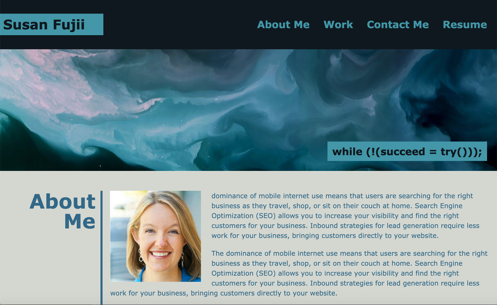
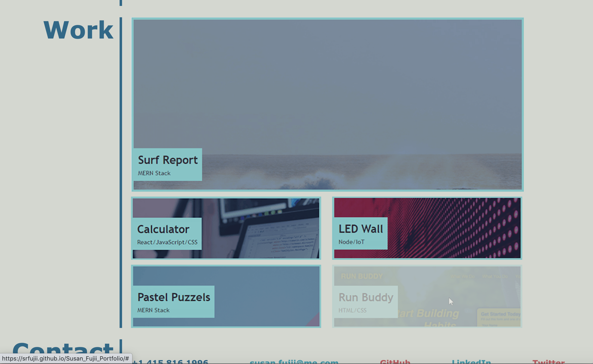
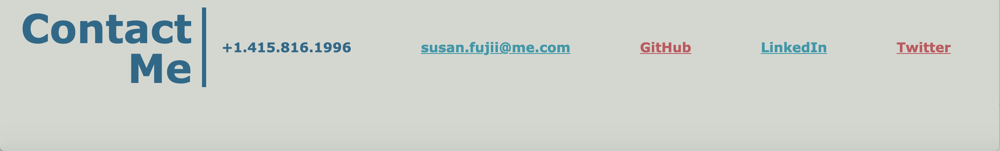
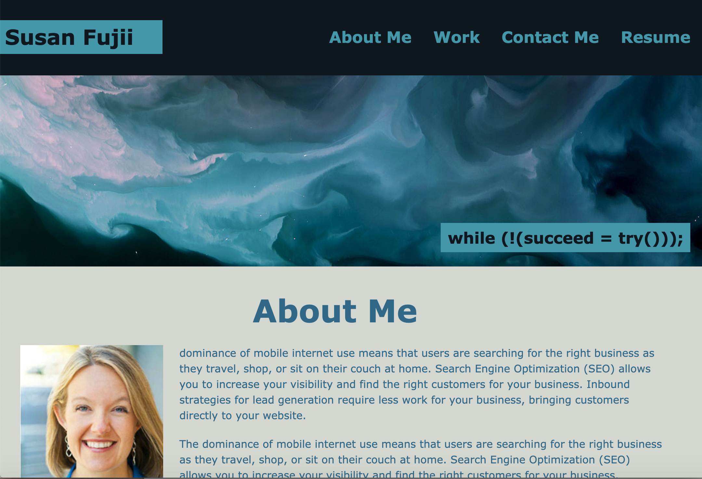
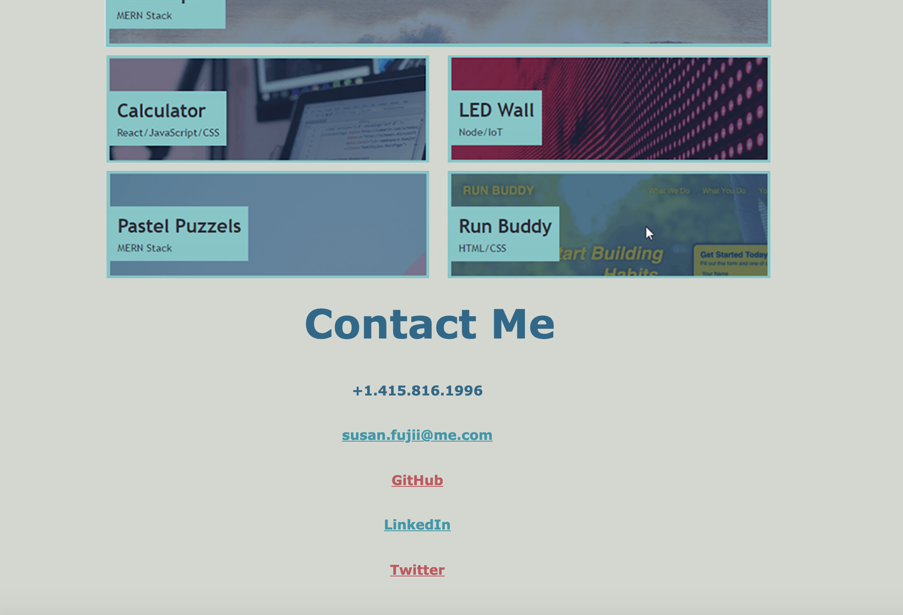
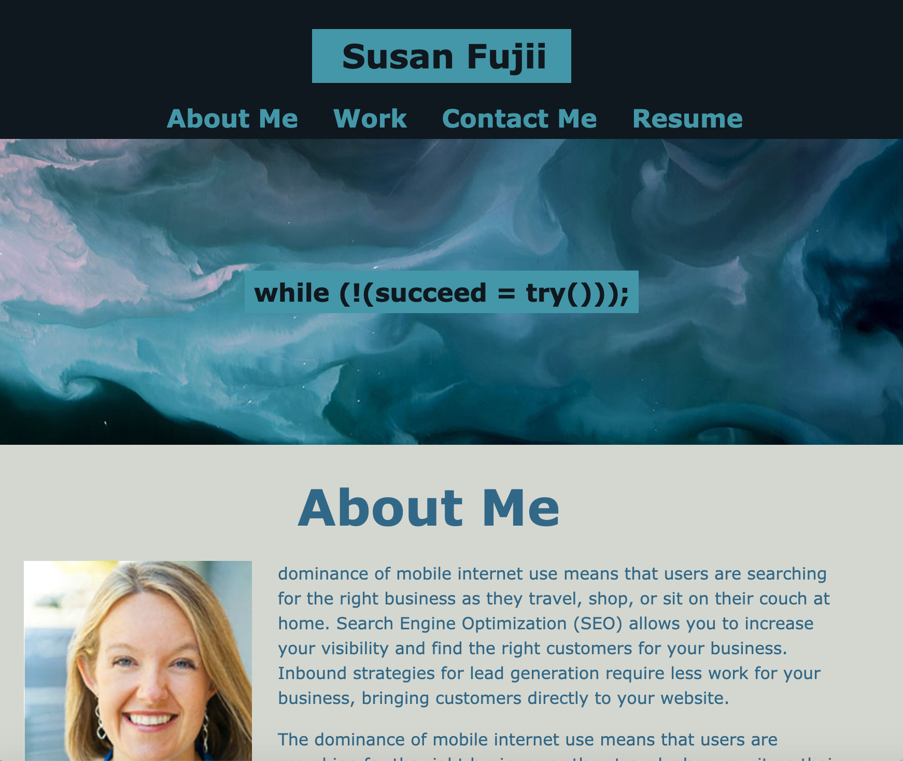
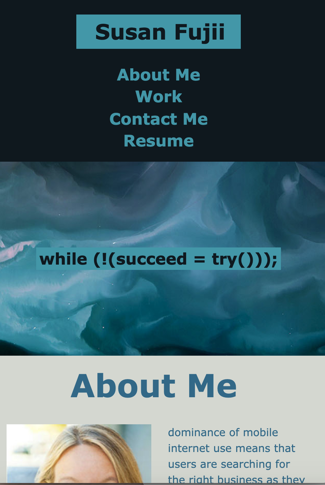
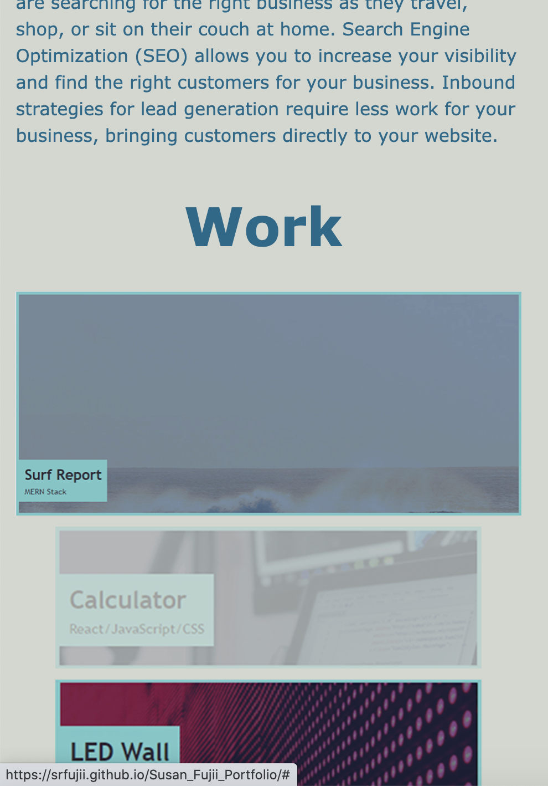
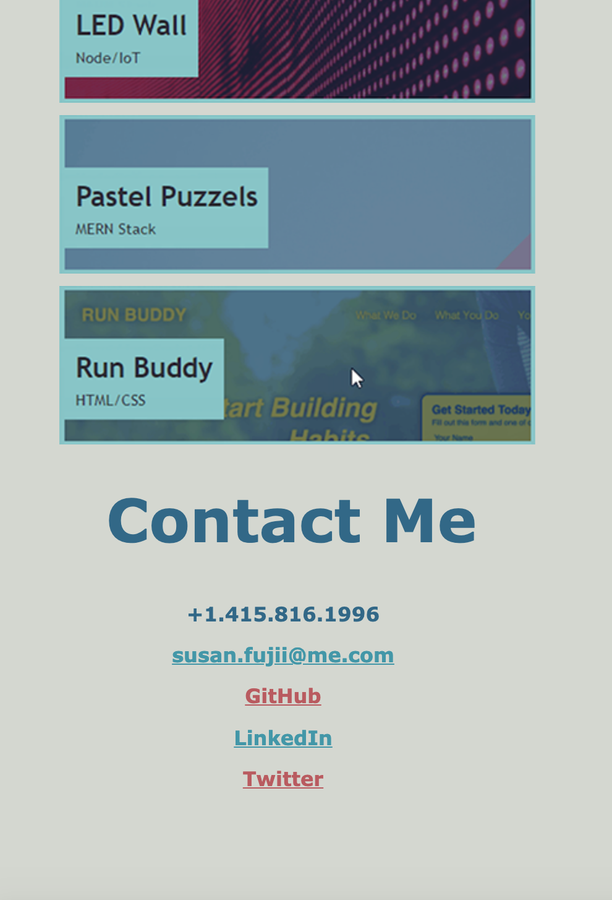

# Susan Fujii's Updated Portfolio and Resume
  
  
## Table of Contents

- [Description](#Description)
- [Motivation](#Motivation)
- [Why I Built This](#Why-I-Built-This)
- [Problem I am Solving](#The-Problem-I-am-Solving)
- [What I Learned](#What-I-Learned)
- [Installation](#Installation)
- [Usage](#Usage)
- [Screenshots](#Screenshots)
- [Credits](#Credits)
- [License](#License)
- [Features](#Features)
- [Contribute](#How-to-Contribute)

## Description

The purpose of this project is to update my online portfolio of work to share with potential employers.

### Motivation

A portfolio of work is used to showcase skills and talents to employers who are looking to fill a part-time or full-time position. An effective portfolio highlights our strongest work as well as our thought processes behind it. Having several live, deployed projects is a minimum requirement to receive an initial interview at many companies, so it is very important to build an online portfolio.

### Why I Built This

With this in mind, I added screenshots with live links to connect to my live projects on GitHub or Heroku, wherever they might be deployed. I also included a link to my updated resume.

This web application is **accessible** to users who will view it both on larger computer screens and also on smaller screen sizes, and the code is **up to current industry standards** and **uses best known practices**.

**Accessibility** is an increasingly important consideration for businesses. Web accessibility ensures that people with disabilities can access a website using assistive technologies like video captions, screen readers, and braille keyboards. **Accessible** sites also rank higher in search engines and ensure that **all** users can easily access the information provided.

### The Problem I am Solving

Before I created this online portfolio, I had no way to show potential employers my skills and live work samples. This online portfolio allows me to:

1. Link to my resume
2. Showcase my live, working public projects
3. Showcase my HTML and CSS skills
4. Tell potential employers a bit about myself
5. Link to my LinkedIn, Twitter, and other social accounts
6. Show that I understand and implement accessibility and responsive design.

## Installation
To view this project, simply visit (https://srfujii.github.io/Updated_Personal_Portfolio/)
 
To install this project on your local machine, simply visit this repo at (https://github.com/srfujii/Updated_Personal_Portfolio/) and use git to clone it to your local environment.

## Usage
This single-page website is quite easy to navigate. Simply click on the top navigation links jump to the section you are interested in. The resume opens my resume in PDF format in a new tab.

## Screenshots
Here are some screenshots for you to preview how my portfolio looks at different screensizes:

### Large Screen Sizes:

### Medium Screen Sizes:

### Small Screen Sizes:

### Tiny Screen Sizes:

## Credits

1. [Rice Technology Bootcamp](https://techbootcamps.rice.edu/)

### Grid/Flexbox Resources:

1. [An Example of Nesting Flexbox inside CSS Grid](https://codepen.io/jensimmons/pen/LyrNqJ)
2. [Mastering Wrapping of Flex Items - CSS: Cascading Style Sheets | MDN](https://developer.mozilla.org/en-US/docs/Web/CSS/CSS_Flexible_Box_Layout/Mastering_Wrapping_of_Flex_Items)
3. [CSS Grid Layout - CSS: Cascading Style Sheets | MDN](https://developer.mozilla.org/en-US/docs/Web/CSS/CSS_Grid_Layout)
4. [Basic Concepts of grid layout - CSS: Cascading Style Sheets | MDN](https://developer.mozilla.org/en-US/docs/Web/CSS/CSS_Grid_Layout/Basic_Concepts_of_Grid_Layout)
5. [CSS Grid Layout](https://www.w3schools.com/css/css_grid.asp)
6. [A Complete Guide to Flexbox | CSS-Tricks](https://css-tricks.com/snippets/css/a-guide-to-flexbox/)
7. [How Flexbox works — explained with big, colorful, animated gifs](https://www.freecodecamp.org/news/an-animated-guide-to-flexbox-d280cf6afc35/)

### General HTML/CSS Resources:

1. [What is the difference between Normalize.css and Reset CSS? - Stack Overflow](https://stackoverflow.com/questions/6887336/what-is-the-difference-between-normalize-css-and-reset-css)
2. (https://necolas.github.io/normalize.css/8.0.1/normalize.css)
3. [html - The Most Efficient CSS Selector: Header Tag, Class or ID? - Stack Overflow](https://stackoverflow.com/questions/14156362/the-most-efficient-css-selector-header-tag-class-or-id)
4. [How To Create Image Hover Overlay Effects](https://www.w3schools.com/howto/howto_css_image_overlay.asp)

## License
[MIT License](./license.txt)

## Features

<ol>
    <li>Semantic HTML implemented in HTML and CSS</li>
    <li>ELements follow logical structure</li>
    <li>All images have accessible alt tags</li>
    <li>Comments added before each CSS element and HTML section</li>
    <li>All hyperlinks work (except where intentionally left blank)</li>
    <li>Title is concise and descriptive</li>
    <li>When portfolio is loaded user is presented with my name, a recent photo, and links to sections about me, my work, and how to contact me</li>
    <li>When global navigation links are clicked, the UI scrolls to the corresponding section</li>
    <li>When the "Work" section is presented, the latest-and-greatest first application is larger than the other work samples</li>
    <li>When Work sample image links are hovered over, the user is provided with a visual cue to show which image link their cursor is over</li>
    <li>When the portfolio is resized or viewed on various screens and devices, the responsive layout adapts to the user's screensize</li>
</ol>

## How to Contribute

